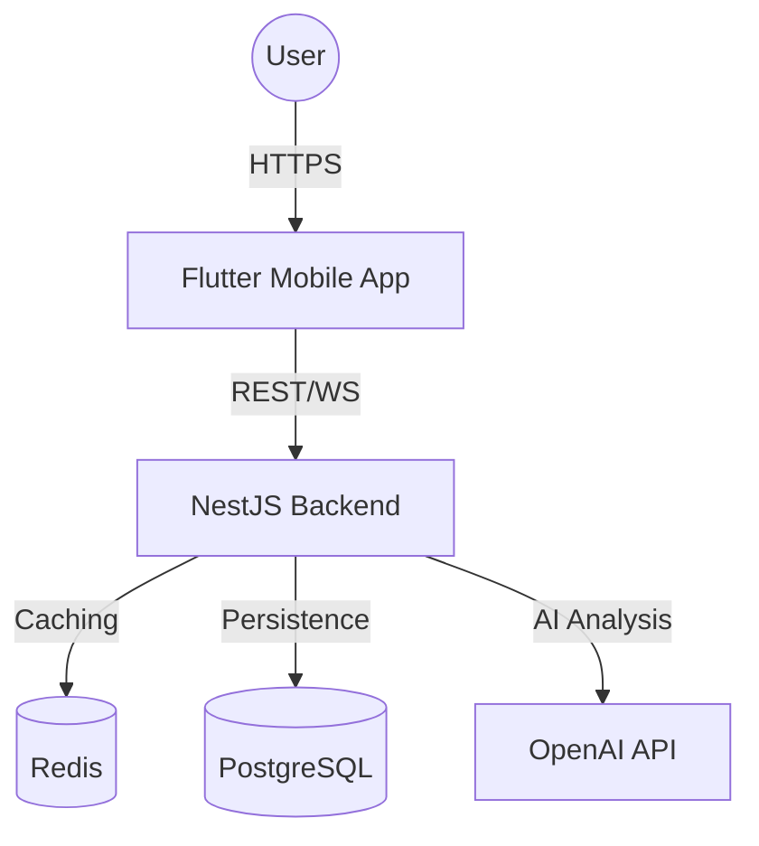

# ISO/IEC/IEEE 42010 Architecture Specification: GuildRoutine

| 문서 번호 | GR-ARCH-001 | 프로젝트 명 | GuildRoutine |
| :--- | :--- | :--- | :--- |
| **버전** | v1.1.0 | **상태** | Approved |

---

## 1. 개요 (Overview)
본 문서는 GuildRoutine 시스템의 아키텍처를 정의하며, ISO/IEC/IEEE 42010 표준에 따라 시스템의 이해관계자, 아키텍처 결정 사항, 그리고 논리적/물리적 뷰를 기술합니다.

## 2. 이해관계자 및 관심사 (Stakeholders & Concerns)
*   **Developers:** 구현의 용이성, 코드 재사용성, 기술적 무결성.
*   **PM/Business:** 비즈니스 목표(AdMob 수익) 달성, 서비스 안정성.
*   **End Users:** 실시간 동기화 품질, 퀘스트의 재미(AI 스토리텔링).
*   **QA Agents:** 요구사항의 검증 가능성 및 테스트 자동화.

## 3. 아키텍처 결정 (Architectural Decisions)

| ID | 결정 사항 | 근거 (Rationale) | 연관 요구사항 |
| :--- | :--- | :--- | :--- |
| **AD-001** | Redis 캐싱 레이어 도입 | OpenAI API 비용 절감 및 대규모 레이드 시 DB 부하 분산. | GR-FR-104, GR-RSK-301 |
| **AD-002** | Socket.io 실시간 통신 | 길드원 간의 즉각적인 보스 레이드 상태 동기화 필요. | GR-FR-102 |
| **AD-003** | PostgreSQL RDBMS 채택 | 길드, 인벤토리, 사용자 간의 복잡한 관계성 및 트랜잭션 무결성 보장. | GR-NFR-202 |

## 4. 논리적 구조 및 추적성 (Logical View & Traceability)

### 4.1 시스템 컴포넌트 맵핑
본 시스템의 아키텍처는 `docs/map.md`의 시맨틱 맵과 동기화되어 있으며, 각 컴포넌트는 SRS의 요구사항을 충족합니다.

| 컴포넌트 명 | 파일 경로 | 책임 (Responsibility) | 충족 요구사항 |
| :--- | :--- | :--- | :--- |
| **AppController** | `backend/src/app.controller.ts` | 외부 요청 진입점 및 라우팅 제어. | GR-FR-101 |
| **AppService** | `backend/src/app.service.ts` | 핵심 비즈니스 로직(AI 퀘스트 변환 등) 수행. | GR-FR-101, GR-FR-104 |
| **AppModule** | `backend/src/app.module.ts` | 시스템 의존성 주입 및 모듈 구성. | GR-NFR-202 |
| **Socket Gateway** | (TBD) | 실시간 보스 레이드 데미지 브로드캐스팅. | GR-FR-102 |

### 4.2 시스템 다이어그램

## 5. 보안 관점 (Security Viewpoint)
*   **Authentication:** 모든 API 요청은 OAuth 2.0 기반 Access Token 검증 필수. (GR-NFR-202)
*   **Data Integrity:** 보스 레이드 데미지 연산 시 서버 측 검증 로직을 거쳐 조작 방지.

---
*ISO 42010 Compliance Review: This document maintains clear traceability from business goals to technical components.*
