# ISO/IEC/IEEE 42010 Architecture Specification

## 1. Overview
This document provides the architectural description of the system, synchronized with the semantic map.

## 2. System Stakeholders
- Humans: Developers, PMs, Architects
- Agents: Coding Agents, QA Agents

## 3. Logical Structure
The following diagram represents the domain boundaries and dependencies.

```mermaid
graph TD
    AppController --> backend
    AppModule --> backend
    AppService --> backend
    AuthController --> backend
    AuthModule --> backend
    AuthService --> backend
    CharacterScreen --> frontend
    FrontendApp --> frontend
    GuildScreen --> frontend
    GuildsGateway --> backend
    GuildsService --> backend
    HabitsController --> backend
    HabitsModule --> backend
    HabitsService --> backend
    HomeScreen --> frontend
    MainNavigationScreen --> frontend
    SRS --> docs
    SettingsScreen --> frontend
    UsersModule --> backend
    UsersService --> backend
    backend/.gitignore --> backend
    docs/tasks/GR-BACKEND-08-GREEN.json --> docs
    docs/tasks/GR-BACKEND-08-RED.json --> docs
    docs/tasks/GR-BACKEND-10-GREEN.json --> docs
    docs/tasks/GR-BACKEND-10-RED.json --> docs
    docs/tasks/GR-BACKEND-11-GREEN.json --> docs
    docs/tasks/GR-BACKEND-11-RED.json --> docs
    docs/tasks/GR-BACKEND-12-GREEN.json --> docs
    docs/tasks/GR-BACKEND-12-RED.json --> docs
    docs/tasks/GR-FRONTEND-04-GREEN.json --> docs
    docs/tasks/GR-FRONTEND-05-GREEN.json --> docs
    docs/tasks/GR-FRONTEND-05-RED.json --> docs
    docs/tasks/GR-FRONTEND-06-GREEN.json --> docs
    docs/tasks/GR-FRONTEND-06-RED.json --> docs
    main --> backend
```

## 4. Components & Responsibilities
- **AppController**: Located in `backend/src/app.controller.ts`. Root controller for NestJS
- **AppService**: Located in `backend/src/app.service.ts`. Root service for NestJS
- **AppModule**: Located in `backend/src/app.module.ts`. Root module for NestJS
- **UsersService**: Located in `backend/src/users/users.service.ts`. User management service
- **UsersModule**: Located in `backend/src/users/users.module.ts`. User management module
- **AuthService**: Located in `backend/src/auth/auth.service.ts`. Authentication service
- **AuthController**: Located in `backend/src/auth/auth.controller.ts`. Authentication controller
- **AuthModule**: Located in `backend/src/auth/auth.module.ts`. Authentication module
- **HabitsService**: Located in `backend/src/habits/habits.service.ts`. Habits management service
- **HabitsController**: Located in `backend/src/habits/habits.controller.ts`. Habits management controller
- **HabitsModule**: Located in `backend/src/habits/habits.module.ts`. Habits management module
- **GuildsService**: Located in `backend/src/guilds/guilds.service.ts`. Guild and Raid management service
- **GuildsGateway**: Located in `backend/src/guilds/guilds.gateway.ts`. Real-time WebSocket communication for Guilds
- **main**: Located in `backend/src/main.ts`. Application entry point
- **MainNavigationScreen**: Located in `frontend/lib/main.dart`. Root navigation with BottomNavigationBar
- **HomeScreen**: Located in `frontend/lib/main.dart`. Home screen (Habit list)
- **CharacterScreen**: Located in `frontend/lib/main.dart`. RPG character stats screen
- **GuildScreen**: Located in `frontend/lib/main.dart`. Social guild screen
- **SettingsScreen**: Located in `frontend/lib/main.dart`. App settings screen
- **FrontendApp**: Located in `frontend/lib/main.dart`. Flutter application entry point
- **SRS**: Located in `docs/planning/Phase6_Requirement_Specification.md`. ISO-compliant System Requirement Specification
- **docs/tasks/GR-BACKEND-08-RED.json**: Located in `docs/tasks/GR-BACKEND-08-RED.json`. RED: Leveling system failing tests
- **docs/tasks/GR-BACKEND-08-GREEN.json**: Located in `docs/tasks/GR-BACKEND-08-GREEN.json`. GREEN: Implement Leveling system
- **docs/tasks/GR-BACKEND-10-RED.json**: Located in `docs/tasks/GR-BACKEND-10-RED.json`. RED: Guild Raid Boss HP Management
- **docs/tasks/GR-BACKEND-10-GREEN.json**: Located in `docs/tasks/GR-BACKEND-10-GREEN.json`. GREEN: Implement Guild Raid Boss HP Management
- **docs/tasks/GR-BACKEND-11-RED.json**: Located in `docs/tasks/GR-BACKEND-11-RED.json`. RED: WebSocket Boss HP Sync tests
- **docs/tasks/GR-BACKEND-11-GREEN.json**: Located in `docs/tasks/GR-BACKEND-11-GREEN.json`. GREEN: Implement WebSocket Boss HP Sync
- **docs/tasks/GR-BACKEND-12-RED.json**: Located in `docs/tasks/GR-BACKEND-12-RED.json`. RED: Redis Write-behind for Boss HP tests
- **docs/tasks/GR-BACKEND-12-GREEN.json**: Located in `docs/tasks/GR-BACKEND-12-GREEN.json`. GREEN: Implement Redis Write-behind for Boss HP
- **docs/tasks/GR-FRONTEND-04-GREEN.json**: Located in `docs/tasks/GR-FRONTEND-04-GREEN.json`. GREEN: Social Chat UI
- **docs/tasks/GR-FRONTEND-05-RED.json**: Located in `docs/tasks/GR-FRONTEND-05-RED.json`. RED: Boss Raid UI failing tests
- **docs/tasks/GR-FRONTEND-05-GREEN.json**: Located in `docs/tasks/GR-FRONTEND-05-GREEN.json`. GREEN: Implement Boss Raid UI & Sync
- **docs/tasks/GR-FRONTEND-06-RED.json**: Located in `docs/tasks/GR-FRONTEND-06-RED.json`. RED: AdMob SDK Spike - Banner Placeholder
- **docs/tasks/GR-FRONTEND-06-GREEN.json**: Located in `docs/tasks/GR-FRONTEND-06-GREEN.json`. GREEN: Implement AdMob Banner Placeholder
- **backend/.gitignore**: Located in `backend/.gitignore`. Backend-specific git ignore rules

---
*Auto-generated by Harness Auto-Documentation Hook*
