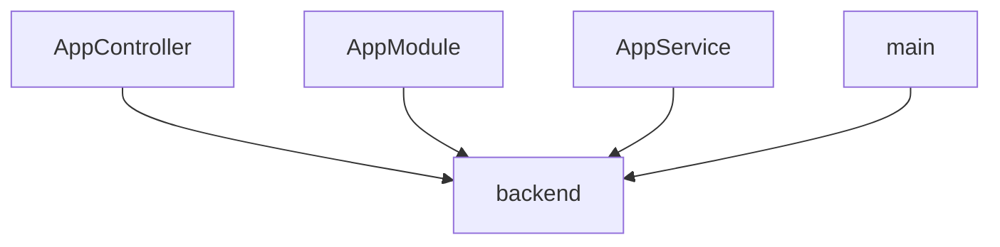

# ISO/IEC/IEEE 42010 Architecture Specification

## 1. Overview
This document provides the architectural description of the system, synchronized with the semantic map.

## 2. System Stakeholders
- Humans: Developers, PMs, Architects
- Agents: Coding Agents, QA Agents

## 3. Logical Structure
The following diagram represents the domain boundaries and dependencies.

## 4. Components & Responsibilities
- **AppController**: Located in `backend/src/app.controller.ts`. Root controller for NestJS
- **AppService**: Located in `backend/src/app.service.ts`. Root service for NestJS
- **AppModule**: Located in `backend/src/app.module.ts`. Root module for NestJS
- **main**: Located in `backend/src/main.ts`. Application entry point

---
*Auto-generated by Harness Auto-Documentation Hook*
