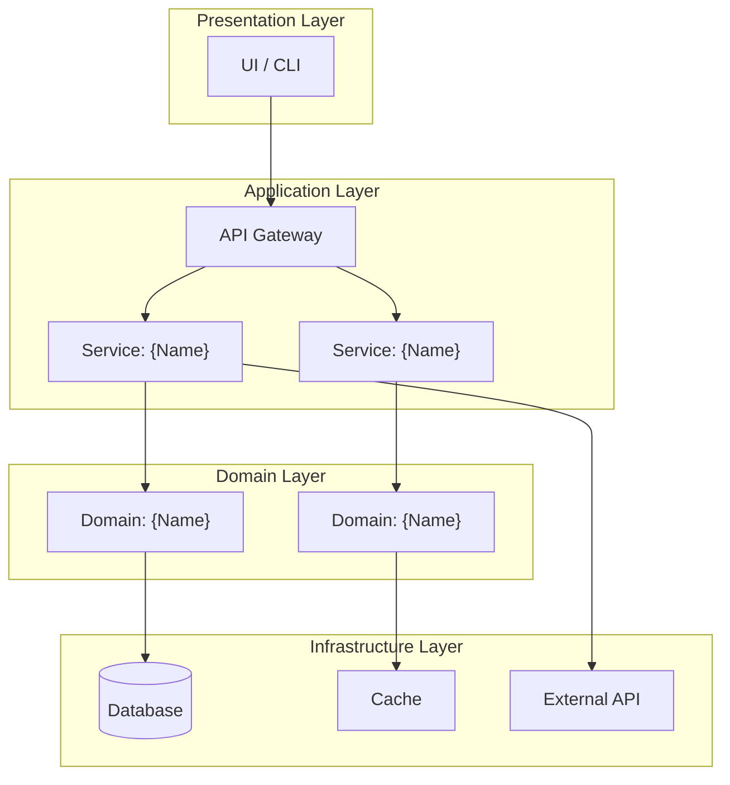
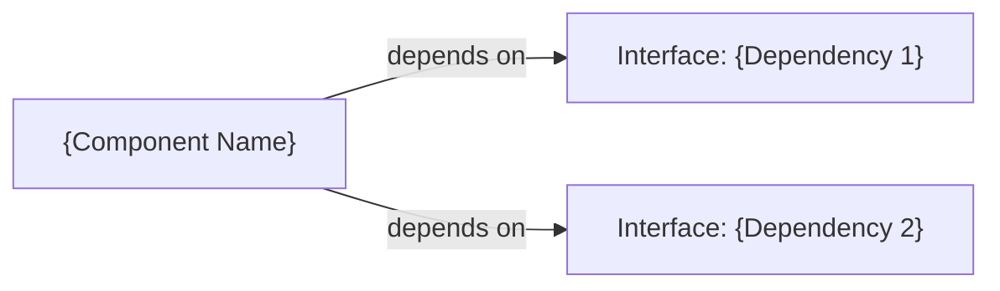
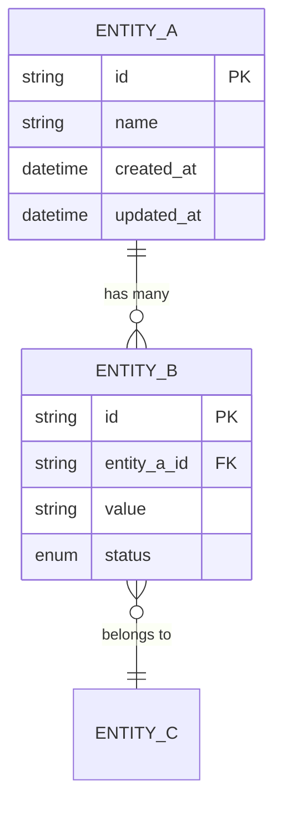
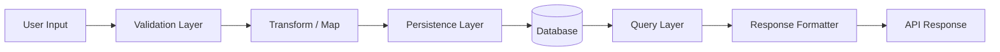
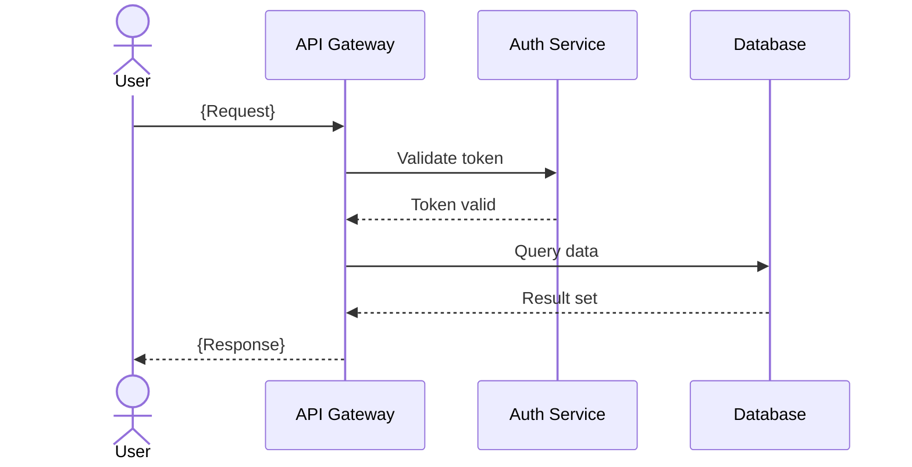
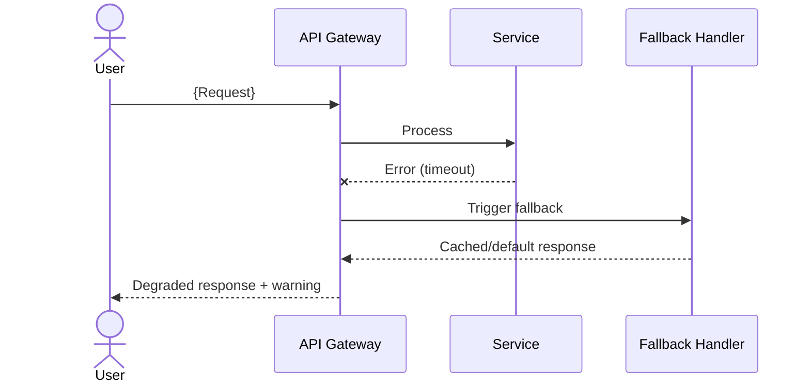

# Software Design Document (SDD)

> **Document ID**: SDD-auto-dev-proj-001
> **Version**: 0.1.0 (Draft)
> **Last Updated**: 2026-05-21
> **Author**: Harness Protocol
> **Status**: Draft | In Review | Approved | Superseded
> **SRS Reference**: [SRS-auto-dev-proj-001](../specs/SRS.md)

---

## Quick Start

1. Ensure the [SRS](../specs/SRS.md) is at least in "In Review" status before writing this document
2. Start with Section 2 (Architecture Overview) — draw the big picture first
3. Each component in Section 3 MUST map to at least one SRS requirement
4. Use mermaid diagrams for all visual representations
5. Reference [ADR](../decisions/) for every significant design choice

---

## Table of Contents

1. [Introduction](#1-introduction)
2. [Architecture Overview](#2-architecture-overview)
3. [Component Design](#3-component-design)
4. [Data Design](#4-data-design)
5. [Interface Design](#5-interface-design)
6. [Sequence Diagrams (Critical Paths)](#6-sequence-diagrams-critical-paths)
7. [Dependency Management](#7-dependency-management)
8. [Error Handling & Resilience](#8-error-handling--resilience)
9. [Security Design](#9-security-design)
10. [Design Decisions & Trade-offs](#10-design-decisions--trade-offs)
11. [Revision History](#11-revision-history)
12. [Related Documents](#12-related-documents)

---

## 1. Introduction

### 1.1 Purpose

This document describes the software design and architecture of **auto-dev-proj**, translating requirements from the [SRS](../specs/SRS.md) into implementable components, interfaces, and data structures.

### 1.2 Design Philosophy

State the core design principles guiding all decisions:

- **Principle 1**: {e.g., "Favor composition over inheritance"}
- **Principle 2**: {e.g., "Every module must be independently testable"}
- **Principle 3**: {e.g., "Fail fast, recover gracefully"}

### 1.3 Technology Stack

| Layer | Technology | Version | Justification (ADR Link) |
|---|---|---|---|
| **Runtime** | {Node.js / Python / Go} | {20.x / 3.11 / 1.22} | [ADR-001](../decisions/ADR-001.md) |
| **Framework** | {Express / FastAPI / Gin} | {4.x / 0.110 / 1.9} | [ADR-002](../decisions/ADR-002.md) |
| **Database** | {PostgreSQL / MongoDB / SQLite} | {16 / 7 / 3} | [ADR-003](../decisions/ADR-003.md) |
| **Test Runner** | {Jest / pytest / go test} | {29 / 8 / stdlib} | — |
| **Coverage Tool** | {c8 / coverage.py / go cover} | {latest} | Harness requires LCOV ≥ 80% |

---

## 2. Architecture Overview

### 2.1 System Architecture Diagram



### 2.2 Architecture Pattern

**Pattern**: {Layered / Microservices / Hexagonal / Event-Driven / Monolith}

**Rationale**: {Why this pattern was chosen. Reference ADR if available.}

**Boundaries**:
- **Presentation ↔ Application**: {REST API / GraphQL / gRPC}
- **Application ↔ Domain**: {Direct function calls / Message bus / Event queue}
- **Domain ↔ Infrastructure**: {Repository pattern / ORM / Direct queries}

### 2.3 Module Boundary Map

| Module | Responsibility | Allowed Dependencies | Forbidden Dependencies |
|---|---|---|---|
| `{module_name}` | {Single-sentence purpose} | {List of modules it CAN import} | {List of modules it MUST NOT import} |

---

## 3. Component Design

### 3.1 Component Template

> Copy this block for each component:

#### Component: {Component Name}

| Attribute | Value |
|---|---|
| **Location** | `{src/path/to/module}` |
| **Responsibility** | {Single Responsibility description} |
| **SRS Requirements** | REQ-{MODULE}-{NNN}, REQ-{MODULE}-{NNN} |
| **Owner** | {Team / Agent} |

**Public Interface**:

```
class {ClassName}:
    def {method_1}({params}) -> {return_type}:
        """
        {Brief description}
        Preconditions: {What must be true before calling}
        Postconditions: {What is guaranteed after calling}
        Throws: {Exception types and when}
        """

    def {method_2}({params}) -> {return_type}:
        """..."""
```

**Internal Design**:
- **State Management**: {Stateless / Stateful — describe state lifecycle}
- **Concurrency Model**: {Single-threaded / Thread-safe / Actor-based}
- **Key Algorithms**: {Brief description of non-trivial algorithms used}

**Dependency Injection**:



---

### 3.2 Component: {First Component}

*(Use template from 3.1)*

### 3.3 Component: {Second Component}

*(Use template from 3.1)*

---

## 4. Data Design

### 4.1 Data Model (Entity Relationship)



### 4.2 Data Dictionary

| Entity | Field | Type | Constraints | Description |
|---|---|---|---|---|
| `{Entity}` | `{field}` | `{string / int / datetime}` | `{PK / FK / NOT NULL / UNIQUE}` | {Description} |

### 4.3 Data Flow



### 4.4 Migration Strategy

| Migration ID | Description | Reversible? | Dependencies |
|---|---|---|---|
| M-001 | {Initial schema creation} | Yes / No | None |
| M-002 | {Add index on {field}} | Yes | M-001 |

#### 4.4.1 Safe Migration Policy

> **MANDATORY**: All auto-generated migrations MUST comply with these safety rules.

**Prohibited DDL Commands** (agent-generated migrations MUST NOT contain):
- `DROP TABLE` / `DROP DATABASE` — Use `RENAME TO ..._deprecated` instead
- `TRUNCATE TABLE` — Use guarded `DELETE FROM ... WHERE {condition}`
- `DROP COLUMN` — Use add-new → migrate → deprecate-old pattern
- `DELETE FROM {table}` without `WHERE` clause

**Test Sandbox Requirement**:
- All migrations MUST be validated against a **memory database** (SQLite `:memory:` / H2) before execution
- Every migration MUST include a corresponding **reverse migration** script
- Agent MUST log the migration diff in `docs/cycle_logs/` before applying

---

## 5. Interface Design

### 5.1 Internal Interfaces (Module-to-Module)

| Provider Module | Consumer Module | Contract | Data Format | Error Contract |
|---|---|---|---|---|
| `{Module A}` | `{Module B}` | `{Function signature / Event name}` | `{Type/Schema}` | `{Exception type}` |

### 5.2 External Interfaces

Reference [API Specification](../api/API_SPEC.md) for full contract details.

| External System | Protocol | Authentication | Rate Limit | Timeout |
|---|---|---|---|---|
| `{System}` | `{REST / gRPC}` | `{API Key / OAuth2}` | `{100 req/min}` | `{30s}` |

---

## 6. Sequence Diagrams (Critical Paths)

### 6.1 Critical Path: {Primary User Flow}



### 6.2 Critical Path: {Error Recovery Flow}



---

## 7. Dependency Management

### 7.1 Dependency Tree

| Package | Version | Purpose | License | Risk Level |
|---|---|---|---|---|
| `{package}` | `{^1.2.3}` | {What it does} | {MIT / Apache-2.0} | {Low / Medium / High} |

### 7.2 Dependency Update Policy

- **Security patches**: Apply within {24h / 1 week}
- **Minor versions**: Review and apply in next sprint
- **Major versions**: Requires ADR and migration plan

### 7.3 Vendoring / Lock Strategy

- **Lock file**: {package-lock.json / poetry.lock / go.sum}
- **Vendoring**: {Yes / No} — {Rationale}

---

## 8. Error Handling & Resilience

### 8.1 Error Classification

| Category | Example | Handling Strategy | User-Facing Message |
|---|---|---|---|
| **Validation Error** | Invalid input format | Return 400 + field-level errors | "Please check your input" |
| **Business Logic Error** | Insufficient permissions | Return 403 + reason | "You don't have access" |
| **Infrastructure Error** | Database timeout | Retry (3x with backoff) → fallback | "Service temporarily unavailable" |
| **Fatal Error** | Out of memory | Log + alert + graceful shutdown | "System error. Contact support." |

### 8.2 Retry & Circuit Breaker Policy

| Operation | Max Retries | Backoff Strategy | Circuit Breaker Threshold |
|---|---|---|---|
| `{DB queries}` | 3 | Exponential (100ms, 200ms, 400ms) | 5 failures in 60s |
| `{External API}` | 2 | Linear (500ms) | 3 failures in 30s |

### 8.3 Logging Standards

| Level | When to Use | Includes PII? | Retention |
|---|---|---|---|
| `ERROR` | Unrecoverable failures | No | 90 days |
| `WARN` | Recoverable issues, degraded performance | No | 30 days |
| `INFO` | Key business events, state transitions | No | 14 days |
| `DEBUG` | Detailed diagnostic information | No (redacted) | 7 days |

---

## 9. Security Design

### 9.1 Authentication & Authorization

| Aspect | Design | Notes |
|---|---|---|
| **Authentication** | {JWT / OAuth2 / API Key} | {Token expiry: 1h / Refresh: 7d} |
| **Authorization** | {RBAC / ABAC / ACL} | {Role hierarchy: Admin > Editor > Viewer} |
| **Secret Management** | {Environment variables / Vault / KMS} | Reference [SCS](../specs/SCS.md) |

### 9.2 Data Protection

| Data Type | At Rest | In Transit | Access Control |
|---|---|---|---|
| {User credentials} | {bcrypt / argon2} | {TLS 1.3} | {Auth service only} |
| {PII} | {AES-256-GCM} | {TLS 1.3} | {Scoped access} |

### 9.3 Input Validation

- **Strategy**: {Whitelist / Schema validation / Parameterized queries}
- **Sanitization**: {HTML escaping / SQL parameterization / Path traversal prevention}

---

## 10. Design Decisions & Trade-offs

For formal architecture decisions, see [ADR directory](../decisions/).

| Decision | Options Considered | Chosen | Rationale |
|---|---|---|---|
| {Database selection} | PostgreSQL, MongoDB, SQLite | PostgreSQL | {ACID compliance, mature ecosystem} |
| {API style} | REST, GraphQL, gRPC | REST | {Team familiarity, tooling support} |

---

## 11. Revision History

| Version | Date | Author | Description |
|---|---|---|---|
| 0.1.0 | 2026-05-21 | Harness Protocol | Initial draft |

---

## 12. Related Documents

| Document | Path | Relationship |
|---|---|---|
| Software Requirements Specification | `docs/specs/SRS.md` | Requirements this design implements |
| Software Configuration Specification | `docs/specs/SCS.md` | Configuration & environment details |
| Architecture Decision Records | `docs/decisions/ADR-*.md` | Formal decision rationale |
| API Specification | `docs/api/API_SPEC.md` | Detailed interface contracts |
| Semantic Map | `docs/map.md` | Auto-generated symbol index |
