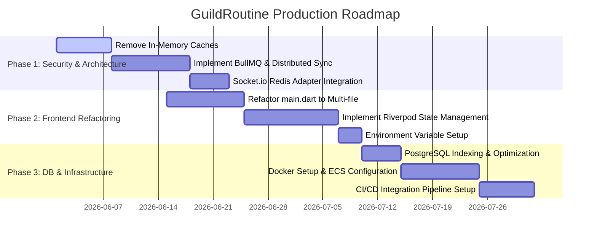

# GuildRoutine Development Roadmap
**Version**: 1.0.0  
**Author**: Technical Director & Lead Architect  
**Next Release Target**: MVP Alpha Release (Q3 2026)

---

## 1. Development Phases & Milestones

---

## 2. Detailed Roadmap Task Breakdown

### Epoch 1: Security & High-Availability Backend (Priority: Critical)

| Task ID | Component | Task Name | Description | Acceptance Criteria |
|---|---|---|---|---|
| **GR-EP1-001** | Backend | Redis-based Boss HP Cache | Evict `hpCache` local Map from `GuildsService`. Query and cache Boss HP in Redis with a 10-minute TTL. | Unit tests pass; zero local Map references. |
| **GR-EP1-002** | Backend | Distributed Lock for Flush | Refactor periodic database damage flush using **NestJS Schedule** combined with a Redis **Redlock** lock. | Single execution across multiple concurrent nodes. |
| **GR-EP1-003** | Backend | Socket.io Scale-out | Integrate `@socket.io/redis-adapter` into NestJS WebSocket Gateway. | Real-time events synchronized across multi-node WebSocket servers. |
| **GR-EP1-004** | Backend | Security Hardening | Set up API rate-limiting via `@nestjs/throttler` and integrate `helmet` security headers. | API requests limited to 100/min per IP. |

### Epoch 2: Presentation & State Clean-up (Priority: High)

| Task ID | Component | Task Name | Description | Acceptance Criteria |
|---|---|---|---|---|
| **GR-EP2-001** | Frontend | Monolith Deconstruction | Split `main.dart` into structured folders: core, presentation, services, models. | App builds clean; `main.dart` is under 50 lines. |
| **GR-EP2-002** | Frontend | Riverpod Integration | Implement Flutter Riverpod state management to handle User details, Guilds, and Inventory. | Screens update dynamically without explicit `setState`. |
| **GR-EP2-003** | Frontend | Environment Config | Set up Dart define configuration to inject endpoints dynamically (`localhost` vs `staging-api.guildroutine.com`). | App builds with `--dart-define` options. |

### Epoch 3: Database & Production Devops (Priority: Medium)

| Task ID | Component | Task Name | Description | Acceptance Criteria |
|---|---|---|---|---|
| **GR-EP3-001** | Database | Database Indexes | Add database indexes on relation keys (`userId`, `guildId`) to prevent query degradations. | Prisma schema updated; index creation verified in DB. |
| **GR-EP3-002** | DevOps | Production Docker Setup | Build optimized multi-stage Dockerfiles for NestJS and configure Docker Compose for local environments. | Docker container starts and passes internal health checks. |
| **GR-EP3-003** | DevOps | AWS ECS Fargate Setup | Set up infrastructure-as-code (Terraform) to deploy backend nodes onto AWS ECS Fargate. | Automated deployments on merge to `master`. |

---

## 3. Product Launch & Growth Phase (Timeline)

### Q3 2026: Closed Alpha (Internal Testing)
- **Goal**: Core habit tracking and Boss Raid synchronization testing with 100 users.
- **Key Metrics**: Daily active user (DAU) retention, WebSocket connection latency, and AdMob test-ad match rate.

### Q4 2026: Open Beta (Public Release)
- **Goal**: Growth hacking via the social invite system. Introduce AI quest variations.
- **Key Metrics**: User Acquisition Cost (UAC) reduction, viral coefficient ($K$-factor > 1.2), and eCPM optimization.
