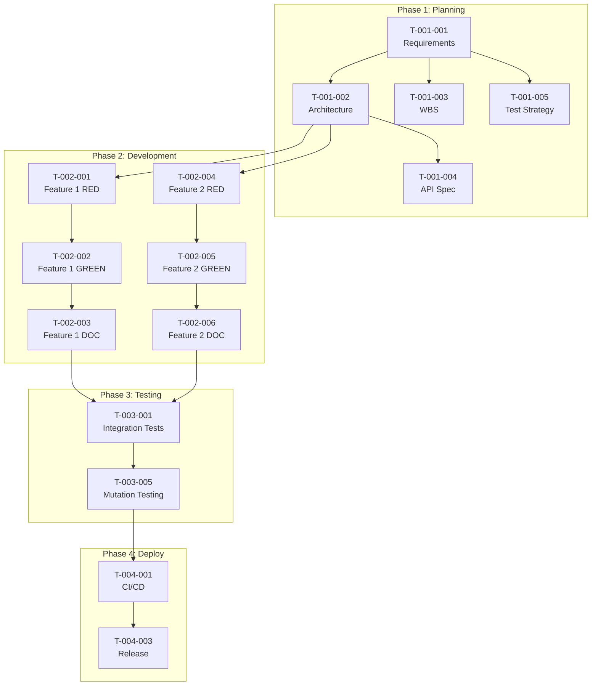
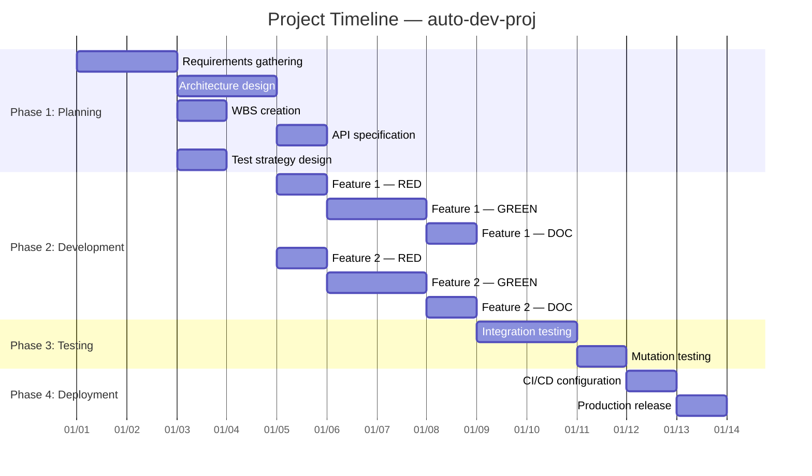

# Work Breakdown Structure (WBS)

> **Document ID**: WBS-auto-dev-proj-001
> **Version**: 0.1.0 (Draft)
> **Last Updated**: 2026-05-21
> **Author**: Harness Protocol
> **Status**: Draft | In Review | Approved | Superseded

---

## Quick Start

1. Break work into **Phase → Task → Sub-task** hierarchy (max 3 levels)
2. Every item MUST have a unique Task ID matching `docs/tasks/{task_id}.json`
3. Assign each item to either `Human` or `Agent` (or specific sub-agent: `QA`, `Dev`, `Doc`)
4. Define dependencies BEFORE starting work — no circular dependencies allowed
5. Update status as work progresses: `Not Started` → `In Progress` → `Completed` → `Verified`

---

## Table of Contents

1. [Overview](#1-overview)
2. [WBS Dictionary](#2-wbs-dictionary)
3. [Work Breakdown Table](#3-work-breakdown-table)
4. [Dependency Graph](#4-dependency-graph)
5. [Gantt Chart](#5-gantt-chart)
6. [Resource Allocation](#6-resource-allocation)
7. [Estimation Summary](#7-estimation-summary)
8. [Revision History](#8-revision-history)
9. [Related Documents](#9-related-documents)

---

## 1. Overview

### 1.1 Purpose

This document decomposes the **auto-dev-proj** project into manageable work packages, defining scope, assignments, dependencies, and timelines for both human developers and AI agents.

### 1.2 WBS Numbering Convention

| Level | Format | Example |
|---|---|---|
| Phase | `P-{NNN}` | `P-001` (Planning Phase) |
| Task | `T-{PHASE}-{NNN}` | `T-001-001` (First task in Phase 1) |
| Sub-task | `ST-{TASK}-{NNN}` | `ST-001-001-001` (First sub-task) |

### 1.3 Status Definitions

| Status | Description | Color |
|---|---|---|
| `Not Started` | Work has not begun | ⬜ |
| `In Progress` | Active development underway | 🟨 |
| `Completed` | Implementation finished, awaiting verification | 🟦 |
| `Verified` | Harness verification passed (coverage ≥ 80%) | 🟩 |
| `Blocked` | Cannot proceed due to dependency or impediment | 🟥 |
| `Deferred` | Postponed to future phase | ⬛ |

---

## 2. WBS Dictionary

> Define each work package with enough detail for unambiguous assignment.

### Work Package Template

| Attribute | Value |
|---|---|
| **Task ID** | `{T-XXX-NNN}` |
| **Task Name** | {Descriptive name} |
| **Phase** | {Phase name} |
| **Description** | {What this work package delivers} |
| **Acceptance Criteria** | {Measurable criteria for completion} |
| **Assignee** | {Human / Agent (QA/Dev/Doc)} |
| **Estimated Effort** | {Hours / Story Points} |
| **Dependencies** | {List of prerequisite Task IDs} |
| **SRS Requirement** | {REQ-XXX-NNN} |
| **Deliverables** | {Specific files/artifacts produced} |
| **Risk Level** | {Low / Medium / High} |

---

## 3. Work Breakdown Table

### Phase 1: Planning & Requirements (P-001)

| Task ID | Task Name | Assignee | Estimated Hours | Dependencies | Status |
|---|---|---|---|---|---|
| T-001-001 | Requirements gathering & SRS draft | Human | 8h | — | ⬜ Not Started |
| T-001-002 | Architecture design & SDD draft | Human | 6h | T-001-001 | ⬜ Not Started |
| T-001-003 | WBS creation & task decomposition | Human | 4h | T-001-001 | ⬜ Not Started |
| T-001-004 | API specification (OpenAPI) | Agent (Dev) | 2h | T-001-002 | ⬜ Not Started |
| T-001-005 | Test strategy (STD) design | Agent (QA) | 2h | T-001-001 | ⬜ Not Started |

### Phase 2: Core Development (P-002)

| Task ID | Task Name | Assignee | Estimated Hours | Dependencies | Status |
|---|---|---|---|---|---|
| T-002-001 | {Feature 1} — RED (test writing) | Agent (QA) | 2h | T-001-002 | ⬜ Not Started |
| T-002-002 | {Feature 1} — GREEN (implementation) | Agent (Dev) | 4h | T-002-001 | ⬜ Not Started |
| T-002-003 | {Feature 1} — DOC (documentation) | Agent (Doc) | 1h | T-002-002 | ⬜ Not Started |
| T-002-004 | {Feature 2} — RED | Agent (QA) | 2h | T-001-002 | ⬜ Not Started |
| T-002-005 | {Feature 2} — GREEN | Agent (Dev) | 4h | T-002-004 | ⬜ Not Started |
| T-002-006 | {Feature 2} — DOC | Agent (Doc) | 1h | T-002-005 | ⬜ Not Started |

#### Sub-tasks for T-002-002

| Task ID | Sub-task Name | Assignee | Estimated Hours | Dependencies | Status |
|---|---|---|---|---|---|
| ST-002-002-001 | {Module A implementation} | Agent (Dev) | 2h | T-002-001 | ⬜ Not Started |
| ST-002-002-002 | {Module B implementation} | Agent (Dev) | 1h | ST-002-002-001 | ⬜ Not Started |
| ST-002-002-003 | {Integration wiring} | Agent (Dev) | 1h | ST-002-002-002 | ⬜ Not Started |

### Phase 3: Integration & Testing (P-003)

| Task ID | Task Name | Assignee | Estimated Hours | Dependencies | Status |
|---|---|---|---|---|---|
| T-003-001 | Integration testing | Agent (QA) | 4h | P-002 (all) | ⬜ Not Started |
| T-003-002 | Performance testing | Human | 4h | T-003-001 | ⬜ Not Started |
| T-003-003 | Security review | Human | 4h | T-003-001 | ⬜ Not Started |
| T-003-004 | Bug fixes & coverage gap filling | Agent (Dev) | 4h | T-003-001 | ⬜ Not Started |
| T-003-005 | Mutation testing validation | Agent (QA) | 2h | T-003-004 | ⬜ Not Started |

### Phase 4: Deployment & Release (P-004)

| Task ID | Task Name | Assignee | Estimated Hours | Dependencies | Status |
|---|---|---|---|---|---|
| T-004-001 | CI/CD pipeline configuration | Human | 4h | P-003 (all) | ⬜ Not Started |
| T-004-002 | Staging deployment & validation | Human | 2h | T-004-001 | ⬜ Not Started |
| T-004-003 | Production release | Human | 2h | T-004-002 | ⬜ Not Started |
| T-004-004 | Post-release documentation | Agent (Doc) | 2h | T-004-003 | ⬜ Not Started |

---

## 4. Dependency Graph



---

## 5. Gantt Chart



---

## 6. Resource Allocation

### 6.1 Resource Matrix

| Resource | Type | Availability | Assigned Phases | Max Concurrent Tasks |
|---|---|---|---|---|
| {Lead Developer} | Human | Full-time | P-001, P-003, P-004 | 2 |
| {QA Agent} | Agent (QA) | On-demand | P-002 (RED), P-003 | 3 (per WIP limit) |
| {Dev Agent} | Agent (Dev) | On-demand | P-002 (GREEN) | 3 (per WIP limit) |
| {Doc Agent} | Agent (Doc) | On-demand | P-002 (DOC), P-004 | 3 (per WIP limit) |

### 6.2 Workload Distribution

| Assignee Type | Total Tasks | Total Estimated Hours | % of Total Effort |
|---|---|---|---|
| Human | {N} | {N}h | {N}% |
| Agent (QA) | {N} | {N}h | {N}% |
| Agent (Dev) | {N} | {N}h | {N}% |
| Agent (Doc) | {N} | {N}h | {N}% |
| **Total** | **{N}** | **{N}h** | **100%** |

---

## 7. Estimation Summary

### 7.1 Effort Summary by Phase

| Phase | Tasks | Sub-tasks | Estimated Hours | Human Hours | Agent Hours |
|---|---|---|---|---|---|
| P-001: Planning | {N} | — | {N}h | {N}h | {N}h |
| P-002: Development | {N} | {N} | {N}h | {N}h | {N}h |
| P-003: Testing | {N} | — | {N}h | {N}h | {N}h |
| P-004: Deployment | {N} | — | {N}h | {N}h | {N}h |
| **Total** | **{N}** | **{N}** | **{N}h** | **{N}h** | **{N}h** |

### 7.2 Critical Path

The longest dependency chain determines the minimum project duration:

```
T-001-001 → T-001-002 → T-002-001 → T-002-002 → T-002-003 → T-003-001 → T-003-005 → T-004-001 → T-004-003
```

**Critical Path Duration**: {N} days

### 7.3 Risk Buffer

| Risk | Impact | Probability | Buffer Allocation |
|---|---|---|---|
| Agent retry loops | +2h per task | Medium | 20% buffer on Agent tasks |
| Requirement changes | Rework of Phase 2 | Low | 10% buffer on total |
| Coverage gaps | Additional test cycles | Medium | 1 extra day in Phase 3 |

---

## 8. Revision History

| Version | Date | Author | Description |
|---|---|---|---|
| 0.1.0 | 2026-05-21 | Harness Protocol | Initial WBS draft |

---

## 9. Related Documents

| Document | Path | Relationship |
|---|---|---|
| Software Requirements Specification | `docs/specs/SRS.md` | Requirements being decomposed |
| Software Design Document | `docs/specs/SDD.md` | Architecture guiding task structure |
| Kanban Board | `docs/agile/KANBAN.md` | Real-time task status (SSOT view) |
| Scrum Sprint Tracking | `docs/agile/SCRUM.md` | Sprint-level planning |
| Task Registry | `docs/tasks/*.json` | Harness task state (source of truth) |
| Quality Metrics | `docs/quality_metrics.md` | Automated quality reporting |

---

## Harness Integration

### Task JSON Mapping

Each WBS task should have a corresponding `docs/tasks/{task_id}.json` entry:

| WBS Field | Task JSON Field |
|---|---|
| Task ID | `.id` |
| Assignee | `.assigned_sub_agent` |
| Status | `.status` |
| Dependencies | `.depends_on` |
| Estimated Hours | `.estimated_hours` (optional) |

### Workflow

1. **Create WBS** → Define all phases, tasks, and sub-tasks
2. **Generate Task JSONs** → `harness.sh docs-init` + create task files for each WBS item
3. **Execute** → Follow RED→GREEN→DOC cycle per task, in dependency order
4. **Track** → Run `harness.sh kanban-render` to update the live Kanban view
5. **Report** → Run `harness.sh document --standard ISO_25010` for quality metrics
