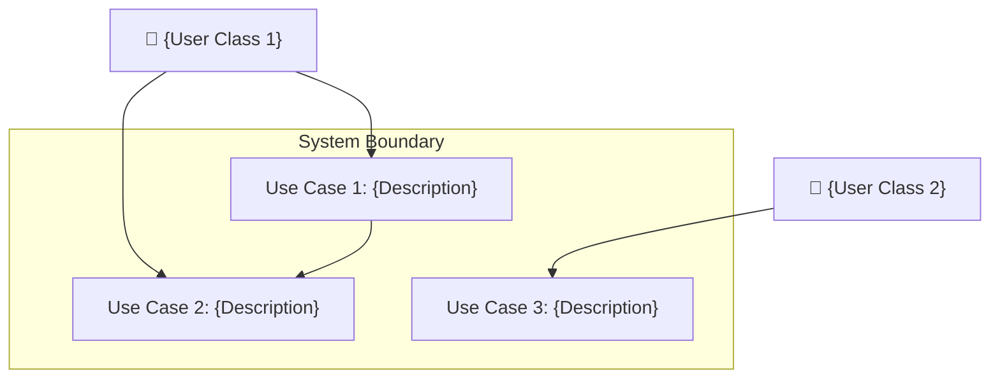
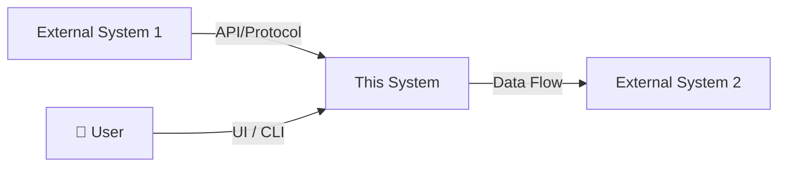

# Software Requirements Specification (SRS)

> **Document ID**: SRS-auto-dev-proj-001
> **Version**: 0.1.0 (Draft)
> **Last Updated**: 2026-05-21
> **Author**: Harness Protocol
> **Status**: Draft | In Review | Approved | Superseded

---

## Quick Start

1. Fill Section 1 (Purpose & Scope) first — this sets all boundaries
2. Define stakeholders in Section 2 before writing any requirements
3. Use the requirement ID format: `REQ-[MODULE]-[NNN]` (e.g., `REQ-AUTH-001`)
4. Every requirement MUST have an acceptance criterion
5. Link each requirement to a test case in [STD](../testing/STD.md) via the Traceability Matrix (Section 8)

---

## Table of Contents

1. [Purpose & Scope](#1-purpose--scope)
2. [Stakeholders & User Classes](#2-stakeholders--user-classes)
3. [System Overview](#3-system-overview)
4. [Functional Requirements](#4-functional-requirements)
5. [Non-Functional Requirements](#5-non-functional-requirements)
6. [External Interface Requirements](#6-external-interface-requirements)
7. [Constraints & Assumptions](#7-constraints--assumptions)
8. [Requirements Traceability Matrix](#8-requirements-traceability-matrix)
9. [Acceptance Criteria Summary](#9-acceptance-criteria-summary)
10. [Glossary](#10-glossary)
11. [Revision History](#11-revision-history)
12. [Related Documents](#12-related-documents)

---

## 1. Purpose & Scope

### 1.1 Purpose

Describe the purpose of this document and the software system it specifies.

- **Problem Statement**: What problem does this system solve? Who experiences this problem?
- **Business Justification**: Why is this system being built? What is the expected ROI or impact?
- **Document Audience**: Who will read this SRS? (developers, QA, PM, stakeholders)

### 1.2 Scope

- **In Scope**: List the specific features, modules, and capabilities this system WILL deliver.
- **Out of Scope**: Explicitly list what this system will NOT deliver (prevents scope creep).
- **Minimum Viable Product (MVP)**: Define the absolute minimum set of features for first release.

### 1.3 Definitions & Abbreviations

| Term | Definition |
|---|---|
| {TERM} | {DEFINITION} |

---

## 2. Stakeholders & User Classes

### 2.1 Stakeholder Registry

| Stakeholder | Role | Interest | Influence | Communication Channel |
|---|---|---|---|---|
| {Name/Team} | {Product Owner / Developer / End User / Ops} | {High / Medium / Low} | {High / Medium / Low} | {Slack / Email / JIRA} |

### 2.2 User Classes & Characteristics

| User Class | Description | Technical Proficiency | Frequency of Use | Priority |
|---|---|---|---|---|
| {Admin} | {System administrator managing configurations} | {High} | {Daily} | {Primary} |
| {End User} | {Consumer-facing user interacting with UI} | {Low-Medium} | {Daily} | {Primary} |
| {Agent (AI)} | {Autonomous agent executing harness tasks} | {N/A (Programmatic)} | {Continuous} | {Secondary} |

### 2.3 Use Case Diagram

---

## 3. System Overview

### 3.1 System Context

Describe where this system fits within the larger ecosystem.

### 3.2 High-Level Architecture Summary

Provide a brief (3-5 sentence) description of the system architecture. Reference [SDD](../specs/SDD.md) for detailed design.

### 3.3 Operating Environment

| Aspect | Specification |
|---|---|
| **Platform** | {OS / Browser / Runtime} |
| **Language & Runtime** | {Node.js 20+ / Python 3.11+ / etc.} |
| **Dependencies** | {List critical external dependencies} |
| **Deployment Target** | {Local / Cloud (AWS, GCP) / Container} |

---

## 4. Functional Requirements

### 4.1 Requirement Template

> Copy this block for each requirement:

#### REQ-{MODULE}-{NNN}: {Requirement Title}

| Attribute | Value |
|---|---|
| **ID** | REQ-{MODULE}-{NNN} |
| **Priority** | P0 (Critical) / P1 (High) / P2 (Medium) / P3 (Low) |
| **Source** | {Stakeholder name / Planning doc reference} |
| **Status** | Proposed / Approved / Implemented / Verified / Deferred |
| **Depends On** | {REQ-XXX-NNN or "None"} |

**Description**: {One clear sentence describing WHAT the system must do.}

**Rationale**: {WHY this requirement exists. What business value does it provide?}

**Acceptance Criteria**:
1. GIVEN {precondition}, WHEN {action}, THEN {expected result}
2. GIVEN {precondition}, WHEN {action}, THEN {expected result}

**Edge Cases**:
- {What happens if input is null/empty?}
- {What happens under concurrent access?}
- {What happens at boundary values?}

**Test Case Link**: [TC-{MODULE}-{NNN}](../testing/STD.md#tc-module-nnn)

---

### 4.2 Module: {Module Name}

#### REQ-{MODULE}-001: {First Requirement}

*(Use template from 4.1)*

#### REQ-{MODULE}-002: {Second Requirement}

*(Use template from 4.1)*

---

## 5. Non-Functional Requirements

### 5.1 Performance Requirements

| ID | Requirement | Metric | Target | Measurement Method |
|---|---|---|---|---|
| NFR-PERF-001 | {Response time for API calls} | {Latency (ms)} | {< 200ms p95} | {Load testing with k6} |
| NFR-PERF-002 | {Throughput} | {Requests/sec} | {> 1000 RPS} | {Benchmark suite} |

### 5.2 Security Requirements

| ID | Requirement | Standard/Compliance |
|---|---|---|
| NFR-SEC-001 | {All data at rest must be encrypted} | {AES-256 / SOC2} |
| NFR-SEC-002 | {Authentication via OAuth 2.0 / API keys} | {OWASP Top 10} |

### 5.3 Reliability & Availability

| ID | Requirement | Target |
|---|---|---|
| NFR-REL-001 | {System uptime} | {99.9% (8.76h downtime/year)} |
| NFR-REL-002 | {Mean Time to Recovery} | {< 15 minutes} |

### 5.4 Scalability

| ID | Requirement | Current Baseline | Target |
|---|---|---|---|
| NFR-SCALE-001 | {Concurrent users} | {100} | {10,000} |

### 5.5 Maintainability

| ID | Requirement | Target |
|---|---|---|
| NFR-MAINT-001 | {Test coverage (line)} | {>= 80% (Harness enforced)} |
| NFR-MAINT-002 | {Code review turnaround} | {< 24 hours} |

### 5.6 Usability

| ID | Requirement | Target |
|---|---|---|
| NFR-UX-001 | {Time to complete primary task} | {< 3 clicks / < 30 seconds} |

---

## 6. External Interface Requirements

### 6.1 User Interfaces

| Interface | Description | Wireframe/Mockup Link |
|---|---|---|
| {Web Dashboard} | {Primary admin interface} | {Link to design file} |

### 6.2 Software Interfaces

| System | Protocol | Data Format | Direction | Frequency |
|---|---|---|---|---|
| {External API} | {REST / gRPC / WebSocket} | {JSON / Protobuf} | {Inbound / Outbound / Bidirectional} | {Real-time / Batch / On-demand} |

### 6.3 Hardware Interfaces

| Hardware | Interface | Notes |
|---|---|---|
| {GPU} | {CUDA 12.x} | {Required for ML inference} |

### 6.4 Communication Interfaces

| Protocol | Port | Security | Notes |
|---|---|---|---|
| {HTTPS} | {443} | {TLS 1.3} | {All API traffic} |

---

## 7. Constraints & Assumptions

### 7.1 Design Constraints

- {Must be compatible with existing {system/framework}}
- {Must use {specific technology} due to team expertise}
- {Budget constraint: {amount}}

### 7.2 Assumptions

- {Users have stable internet connection}
- {External API {X} maintains backward compatibility}
- {Team has access to {tool/resource}}

### 7.3 Risks

| Risk ID | Description | Probability | Impact | Mitigation |
|---|---|---|---|---|
| RISK-001 | {Third-party API deprecation} | {Medium} | {High} | {Abstract via adapter pattern} |

---

## 8. Requirements Traceability Matrix

| Requirement ID | Description | Priority | Test Case ID | ADR Link | Status |
|---|---|---|---|---|---|
| REQ-{MODULE}-001 | {Brief desc} | P0 | TC-{MODULE}-001 | ADR-001 | Proposed |
| REQ-{MODULE}-002 | {Brief desc} | P1 | TC-{MODULE}-002 | — | Approved |

---

## 9. Acceptance Criteria Summary

| Milestone | Criteria | Verification Method | Owner |
|---|---|---|---|
| MVP Release | All P0 requirements pass acceptance tests | Automated test suite + manual review | {QA Lead} |
| v1.0 Release | All P0 + P1 requirements verified | Full STR report | {QA Lead} |

---

## 10. Glossary

| Term | Definition |
|---|---|
| Harness | AI agent protocol engine enforcing TDD, coverage, and governance |
| SSOT | Single Source of Truth — one canonical location for each piece of information |
| Cycle Log | Mandatory reasoning document written before each code change |

---

## 11. Revision History

| Version | Date | Author | Description |
|---|---|---|---|
| 0.1.0 | 2026-05-21 | Harness Protocol | Initial draft |

---

## 12. Related Documents

| Document | Path | Relationship |
|---|---|---|
| Software Design Document | `docs/specs/SDD.md` | Design implementation of these requirements |
| Architecture Decision Records | `docs/decisions/ADR-*.md` | Design rationale for requirement solutions |
| Software Test Design | `docs/testing/STD.md` | Test cases verifying these requirements |
| Software Test Report | `docs/testing/STR.md` | Test execution results |
| API Specification | `docs/api/API_SPEC.md` | Interface contracts for external requirements |
